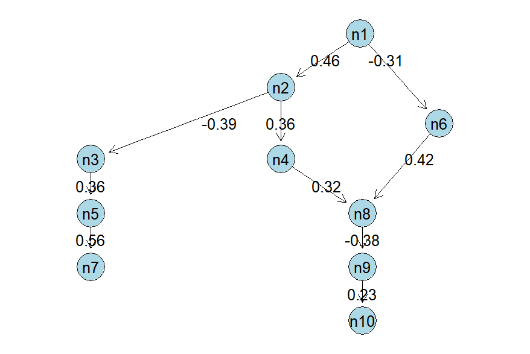

`MR.GRAIN` is a a novel causal inference framework for **G**enetically anchored **R**econstruction of c**A**usal b**I**omolecular **N**etworks. Specifically, MR-GRAIN uses biomolecule-specific genetic instruments as anchors that perturb individual nodes and provide directional information for learning network structure within a unified structural equation modeling framework. Building on this anchor structure, MR-GRAIN recovers a sparse directed biomolecular network and refines the network through continuous optimization to ensure an acyclic structure.

## Prerequisites

Ensure the following R packages are installed. This workflow relies on `BiocManager` for graph-theoretic dependencies.

```r
if (!requireNamespace("BiocManager", quietly = TRUE))
  install.packages("BiocManager")

BiocManager::install(c("graph", "RBGL", "Rgraphviz"))
install.packages(c("Matrix", "pcalg", "AER", "expm", "MASS"))
```

## Installation
You can install the development version of `MR.GRAIN` from Github via the `devtools` package.
```
devtools::install_github("MinhaoYaooo/MR.GRAIN")
```

## Data Generation

In this section, the data generation process is explicitly defined below. We simulate a network Mendelian randomization setting where:
* **n = 5000**: Sample size.
* **p = 10**: Number of phenotypes (e.g., protein levels).
* **q = 40**: Total genetic variants (instruments), with exactly **4 distinct SNPs** acting as valid instruments for each phenotype.

The simulation accounts for pleiotropy via unobserved confounders ($U$) and generates phenotypes ($X$) based on the structural equation $X = (Z\Gamma^T + U\Pi + E)(I - B^T)^{-1}$.

### Example Code

You can run this snippet directly to generate the simulation data components (`X`, `Z`, `S`, `B_true`) and visualize the true causal graph.

```r
library(Rgraphviz)
library(graph)

# --- 1. Parameters ---
set.seed(123)      # For reproducibility
n <- 5000          # Sample size
p <- 10            # Number of nodes
snps_per_node <- 4 # Fixed SNPs per node
q <- p * snps_per_node # Total SNPs = 40

# --- 2. Instruments (S) & Gamma ---
# S is a list where S[[j]] contains indices of valid instruments for node j
S <- vector("list", p)
Gamma <- matrix(0, p, q) # Effect of SNPs on phenotypes (p x q)

curr_idx <- 1
for (j in 1:p) {
  # Assign block of 4 SNPs to each node
  S[[j]] <- curr_idx:(curr_idx + snps_per_node - 1)
  
  # Set instrument strength (Gamma) for valid SNPs
  Gamma[j, S[[j]]] <- runif(snps_per_node, 0.2, 0.4)
  curr_idx <- curr_idx + snps_per_node
}

# --- 3. Genotypes (Z) ---
# Simulate genotypes as Binomial(2, MAF)
Z <- matrix(rbinom(n * q, 2, 0.3), nrow = n, ncol = q)

# --- 4. Causal Topology (B_true) ---
# Fixed DAG structure (Target, Source)
# B[j, i] != 0 implies edge i -> j
B_true <- matrix(0, p, p)

# Define specific causal edges (Cascade: 1->2->3->... and some branches)
B_true[2, 1] <-  0.5   # Node 1 -> Node 2
B_true[3, 2] <- -0.4   # Node 2 -> Node 3
B_true[4, 2] <-  0.3   # Node 2 -> Node 4
B_true[5, 3] <-  0.4   # Node 3 -> Node 5
B_true[6, 1] <- -0.3   # Node 1 -> Node 6
B_true[7, 5] <-  0.5   # Node 5 -> Node 7
B_true[8, 4] <-  0.3   # Node 4 -> Node 8
B_true[8, 6] <-  0.4   # Node 6 -> Node 8
B_true[9, 8] <- -0.4   # Node 8 -> Node 9
B_true[10,9] <-  0.3   # Node 9 -> Node 10


# Visualize the Ground Truth DAG with Weights
g <- new("graphAM", adjMat = t(B_true) != 0, edgemode = "directed")

# Prepare edge labels
# edgeNames(g) returns strings like "1~2" (Source~Target)
edge_names <- edgeNames(g)
edge_labels <- setNames(character(length(edge_names)), edge_names)

for (e in edge_names) {
  parts <- strsplit(e, "~")[[1]]
  src <- as.numeric(strsplit(parts[1], "n")[[1]][2])
  tgt <- as.numeric(strsplit(parts[2], "n")[[1]][2])
  
  # Extract weight from B_true [target, source]
  weight <- B_true[tgt, src]
  edge_labels[e] <- as.character(round(weight, 2))
}

# Plot with edge weights
plot(g, 
     attrs = list(node = list(fillcolor = "lightblue", shape = "circle")),
     edgeAttrs = list(label = edge_labels))


# --- 5. Phenotypes (X) ---
# Model: X = (Z*Gamma' + U*Pi + E) * (I - B')^-1
# Add unobserved confounders (U) and noise (E)
r <- 3 # Number of hidden confounders
U <- matrix(rnorm(n * r), n, r)
Pi <- matrix(runif(r * p, 0.3, 0.6), r, p) # Confounder effects
E <- matrix(rnorm(n * p), n, p)

I_minus_B_T <- diag(p) - t(B_true)
RHS <- (Z %*% t(Gamma)) + (U %*% Pi) + E

# Solve structural equation
X <- RHS %*% solve(I_minus_B_T)

# Data is now ready: X (Phenotypes), Z (Genotypes), S (Instrument Map)
```

Below is the **Ground Truth DAG** generated by the code above. The edge labels indicate the causal parameters to be estimated in `B_true`.

<p align="center">
  
</p>

## Usage

To estimate the causal graph, use the `MR_GRAIN` function. This function performs a two-step estimation:
1.  **IV Regression:** Estimates pairwise effects using the provided genetic instruments ($S$).
2.  **NOTEARS Projection:** Projects the initial estimate onto the space of DAGs to resolve cycles and enforce sparsity.

```r
# Run MR-GRAIN estimation
# lam: Sparsity penalty (L1 regularization)
# w: Cutoff for small edge weights
results <- MR_DAG(X, Z, S, lam = 0.01, w_threshold = 0.1)
print(results)
```

## Interpretation

### 1. Adjacency Matrix (`$B_DAG`)

The matrix is oriented as **Target $\leftarrow$ Source**.
* **Row $j$, Column $i$** ($B_{ji}$) represents the causal effect of **Node $i$ on Node $j$**.
* **Example:** In the output below, entry `[2, 1]` is `0.5078`. This indicates that **Node 1** has a positive causal effect on **Node 2** with strength ~0.51.

```text
$B_est
      [,1]       [,2]       [,3]       [,4]       [,5]       [,6] [,7]       [,8]       [,9] [,10]
 [1,]  0.0000000  0.0000000  0.0000000  0.0000000  0.0000000  0.0000000    0  0.0000000  0.0000000     0
 [2,]  0.5078638  0.0000000  0.0000000  0.0000000  0.0000000  0.0000000    0  0.0000000  0.0000000     0
 [3,]  0.0000000 -0.3531218  0.0000000  0.0000000  0.0000000  0.0000000    0  0.0000000  0.0000000     0
 [4,]  0.0000000  0.3768854  0.0000000  0.0000000  0.0000000  0.0000000    0  0.0000000  0.0000000     0
 [5,]  0.0000000  0.0000000  0.3553861  0.0000000  0.0000000  0.0000000    0  0.0000000  0.0000000     0
 [6,] -0.3246943  0.0000000  0.0000000  0.0000000  0.0000000  0.0000000    0  0.0000000  0.0000000     0
 [7,]  0.0000000  0.0000000  0.0000000  0.0000000  0.5344076  0.0000000    0  0.0000000  0.0000000     0
 [8,]  0.0000000  0.0000000  0.0000000  0.3540929  0.0000000  0.4554284    0  0.0000000  0.0000000     0
 [9,]  0.0000000  0.0000000  0.0000000  0.0000000  0.0000000  0.0000000    0 -0.3614605  0.0000000     0
[10,]  0.0000000  0.0000000  0.0000000  0.0000000  0.0000000  0.0000000    0  0.0000000  0.2604913     0
```

### 2. Statistical Inference (`$sd` and `$pval`)

Standard errors and P-values for non-zero entries of MR-GRAIN adjacency matrix.

```text
$sd
            [,1]       [,2]       [,3]       [,4]       [,5]       [,6] [,7]      [,8]       [,9] [,10]
 [1,]         NA         NA         NA         NA         NA         NA   NA        NA         NA    NA
 [2,] 0.04398967         NA         NA         NA         NA         NA   NA        NA         NA    NA
 [3,]         NA 0.05054897         NA         NA         NA         NA   NA        NA         NA    NA
 [4,]         NA 0.04437383         NA         NA         NA         NA   NA        NA         NA    NA
 [5,]         NA         NA 0.04483519         NA         NA         NA   NA        NA         NA    NA
 [6,] 0.05513177         NA         NA         NA         NA         NA   NA        NA         NA    NA
 [7,]         NA         NA         NA         NA 0.05128144         NA   NA        NA         NA    NA
 [8,]         NA         NA         NA 0.04251763         NA 0.03439423   NA        NA         NA    NA
 [9,]         NA         NA         NA         NA         NA         NA   NA 0.0451896         NA    NA
[10,]         NA         NA         NA         NA         NA         NA   NA        NA 0.04658384    NA

$pval
              [,1]         [,2]         [,3]         [,4]         [,5]         [,6] [,7]         [,8]         [,9] [,10]
 [1,]           NA           NA           NA           NA           NA           NA   NA           NA           NA    NA
 [2,] 3.647518e-25           NA           NA           NA           NA           NA   NA           NA           NA    NA
 [3,]           NA 7.172115e-15           NA           NA           NA           NA   NA           NA           NA    NA
 [4,]           NA 8.955383e-16           NA           NA           NA           NA   NA           NA           NA    NA
 [5,]           NA           NA 1.773746e-15           NA           NA           NA   NA           NA           NA    NA
 [6,] 1.269732e-08           NA           NA           NA           NA           NA   NA           NA           NA    NA
 [7,]           NA           NA           NA           NA 1.767542e-27           NA   NA           NA           NA    NA
 [8,]           NA           NA           NA 6.443038e-14           NA 2.615124e-34   NA           NA           NA    NA
 [9,]           NA           NA           NA           NA           NA           NA   NA 1.701726e-17           NA    NA
[10,]           NA           NA           NA           NA           NA           NA   NA           NA 5.763646e-07    NA
```

We can also visualize the estimated DAG using the above codes by changing `B_true` to `results$B_DAG`.

<p align="center">
  
</p>
